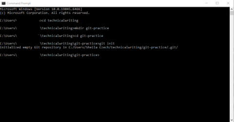
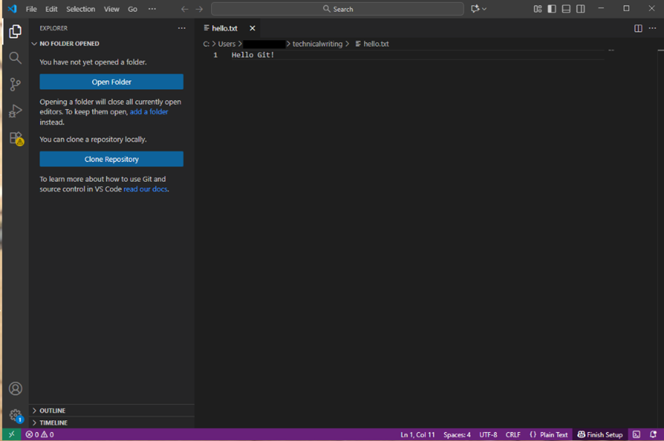
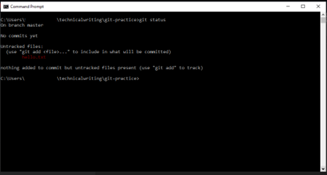

**Basic Git Workflow (Beginner Guide)**

**Overview**

This document introduces a simple workflow using Git to track changes in a project. You will learn how to initialize a repository, stage changes, and create commits.

**Prerequisites**

- Git installed on your system
- A computer running Windows 11 (or Windows 10/macOS)
- Basic familiarity with files and folders
- Access to Windows Terminal or another command-line interface

**Key Concepts**

- **Repository (repo):** A folder tracked by Git
- **Staging area:** Where changes are prepared before committing
- **Commit:** A snapshot of changes

**Step 1: Initialize a Repository**

1.  Open Windows Terminal
2.  Navigate to your project folder:
    1.  cd technicalwriting
3.  Create a new folder and move into it:
    1.  mkdir git-practice
    2.  cd git-practice
4.  Initialize a Git repository:
    1.  git init

**Expected Output:** Initialized empty Git repository

**Step 2: Create a File**

1.  Create a new text file using a code editor like Visual Studio Code
2.  Add some content, for example: Hello Git!
3.  Save the file as hello.txt

** Expected Output **

**Step 3: Check Repository Status**

1.  git status

**Description:**  
Shows the current state of your repository.

**Expected Output:**

1.  File listed as **untracked** 

**Step 4: Stage Changes**

Add the file to the staging area:

1.  git add hello.txt
2.  Run status again: git status

**Expected Result:**

File now listed under “Changes to be committed”

**Step 5: Commit Changes**

Create a commit:

1.  git commit -m "Initial commit"

**Description:**  
Saves a snapshot of your changes.

**Step 6: View Commit History**

1.  git log

**Description:**  
Displays a list of commits.

**Common Errors and Solutions**

**Error: “git is not recognized”**

**Cause:** Git is not installed or not added to PATH

**Solution:**

1.  Reinstall Git
2.  Ensure it is added to system PATH

**Error: Nothing to commit**

**Cause:** No changes staged

**Solution:**

1.  git add .

**Error: Missing commit message**

**Cause:** -m flag not used

**Solution:**

1.  git commit -m "Your message"

**Tips**

💡 Use git status frequently to understand what’s happening  
💡 Write clear commit messages (e.g., “Add login feature”)  
💡 Keep commits small and focused

**Conclusion**

This basic workflow in Git demonstrates how to track changes, stage updates, and create commits. These core skills are essential for working with version-controlled projects.
